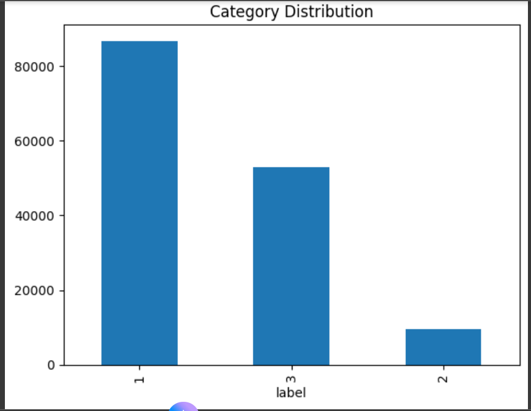
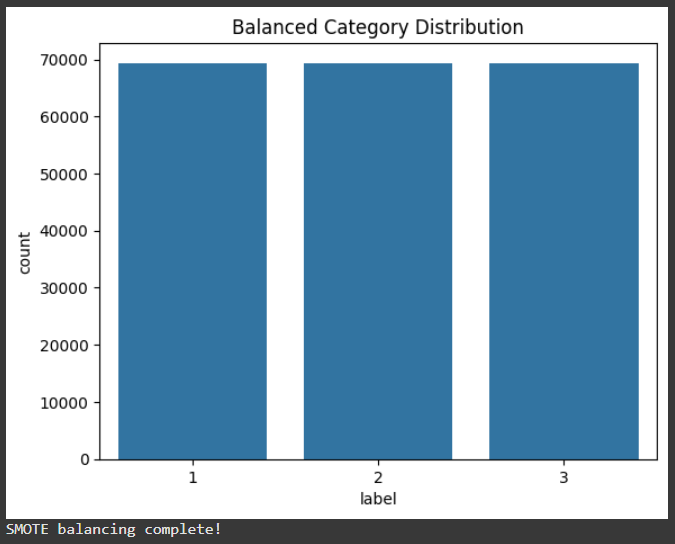
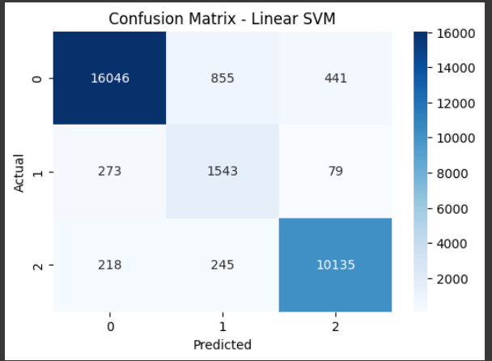
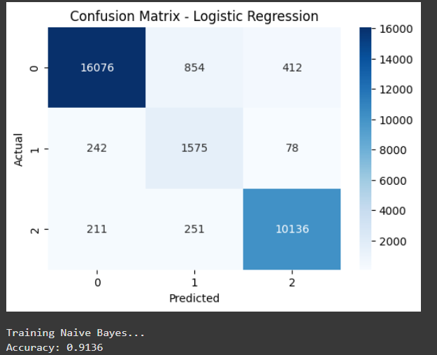
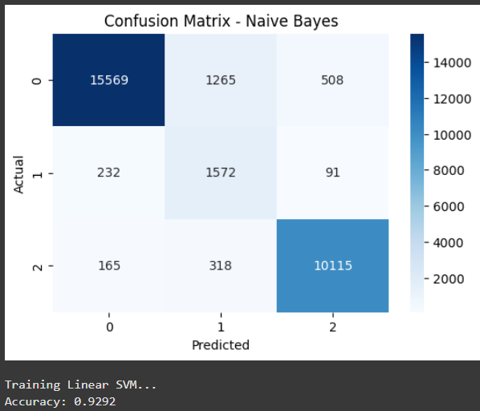

# Task 5: Consumer Complaint Text Classification

**Submitted by:** Mehalaa S  
**Date:** 28-Sep-2025  

---

## 📌 Project Overview
This project performs text classification on consumer complaint data using machine learning.  
The complaints are classified into the following categories:

| Label | Category           |
|-------|--------------------|
| 0     | Credit Reporting   |
| 1     | Debt Collection    |
| 2     | Consumer Loan      |
| 3     | Mortgage           |

### Key Features:
- Data cleaning & preprocessing  
- TF-IDF feature extraction  
- Multi-class classification using Logistic Regression and Naive Bayes  
- Evaluation metrics: accuracy, classification report, confusion matrix  
- Visualizations: class distribution, word clouds  

---

## 💻 Installation
### Run the notebook:
You can open and run the notebook directly in Google Colab without installing anything:  
[Open Task5.ipynb in Google Colab](https://colab.research.google.com/drive/1_XSjz7pMzBxRzUD26_1s4Do5JFQ6LsNO#scrollTo=SjBdfhqQYJsd)*

---

## 📂 Dataset
The dataset used for this task is:  
`dataset/rows.xlsx`

It contains consumer complaint data including:
- Date received  
- Product  
- Sub-product  
- Issue  
- Consumer complaint narrative  

---

## 📸 Screenshots
Here are the screenshots for the task:

### Screenshot 1 — category distribution:

### Screenshot 2 — balancedcategorydistribution:

### Screenshot 3 — linearsvm:

### Screenshot 4 — logisticregression:

### Screenshot 5 —Naivebayes:

---

**Author:** Mehalaa S
# project_task5
